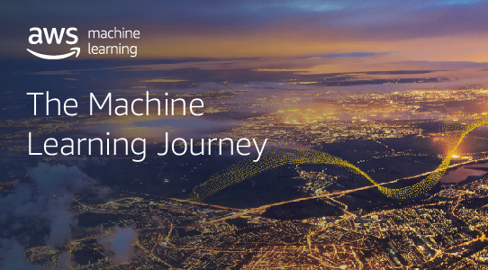

# AWS AI/ML Exemplos no Setor Público

Este repositório visa demonstrar alguns casos de utilização de serviços de Inteligência Artificial (AI) e Aprendizado de Máquina (ML) no setor público (GOV, EDU, NPO).

 

 

## Outros Materiais Interessantes

- Detecção PPE: https://github.com/aws-samples/aws-reinforce2019-ppe-detection-demo
- Exemplos com SageMaker: https://github.com/awslabs/amazon-sagemaker-examples
- Chatbot para criação de conteúdo: https://github.com/aws-samples/aws-braziltechtalk2019-aiservices-demo
- MLOps: https://github.com/awslabs/amazon-sagemaker-mlops-workshop

## License Summary

This sample code is made available under the MIT-0 license. See the LICENSE file.
