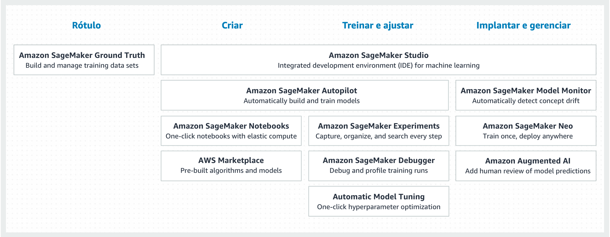

# SageMaker

O Amazon SageMaker é um serviço totalmente gerenciado que fornece a todos os desenvolvedores e cientistas de dados a capacidade de criar, treinar e implantar modelos de machine learning (ML) rapidamente. O SageMaker remove o trabalho pesado de cada etapa do processo de machine learning para facilitar o desenvolvimento de modelos de alta qualidade.

</br>
<p align="center"></p>
</br>

## Features

</br>
<p align="center"></p>
</br>

## Executando um Notebook

1. Navegue para [https://console.aws.amazon.com/sagemaker/home?region=us-east-1#/notebook-instances](https://console.aws.amazon.com/sagemaker/home?region=us-east-1#/notebook-instances)
2. Abra seu notebook (Jupyter Notebook ou Jupyter Lab). Ao abrir o notebook, iremos clonar esse repositório:

   - Click em **New** e crie um novo terminal
   - Execute os comandos abaixo:

   ```
   cd SageMaker
   git clone https://github.com/gabrielmartinigit/aws-aiml-publicsector-examples.git
   ```

   - Feche o terminal

3. Vá para **sagemaker/notebooks**

## License Summary

This sample code is made available under the MIT-0 license. See the LICENSE file.
